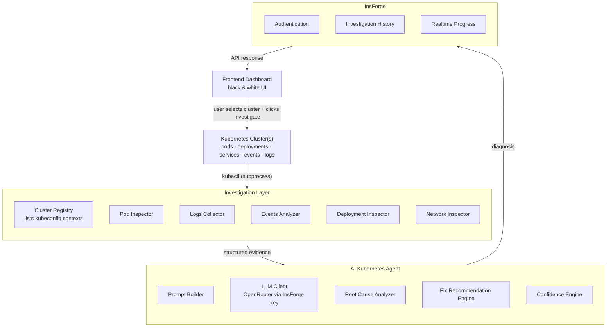
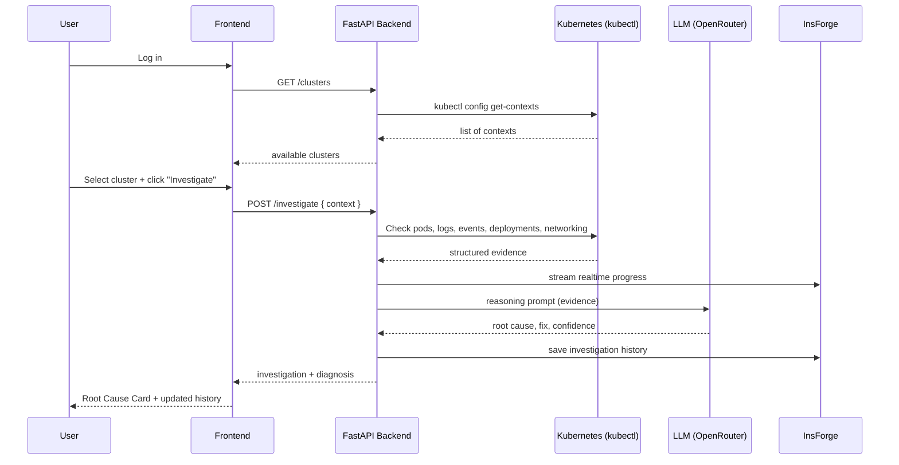

# AI Kubernetes Troubleshooting Agent

An AI-powered, on-demand Kubernetes troubleshooting platform. Point it at
any cluster in your local kubeconfig, click **Investigate**, and get a
root cause, a confidence score, and an exact `kubectl` fix — not just a
log dump.

> This is a troubleshooting tool, not a controller/operator. It only acts
> when a user triggers an investigation — it never watches or reconciles
> cluster state in the background.

---

## What it does

- Connects to any cluster in your local kubeconfig (multi-cluster aware)
- Investigates pods, logs, events, deployments, and networking
- Sends the collected evidence to an LLM (via OpenRouter) that reasons
  like a senior Kubernetes SRE
- Returns a root cause, an explanation, a concrete fix, and a confidence
  score — grounded in the evidence, not guessed
- Saves investigation history and streams live progress per cluster
- Ships with a deliberately minimal **black-and-white UI** — no color,
  status communicated through shape, weight, and text

---

## Architecture



**Orchestrator:** FastAPI sits in the middle of every request — InsForge
provides auth, history, and realtime channels, but it never replaces the
backend as the thing that actually runs an investigation.

**Cluster access:** all Kubernetes interaction goes through `kubectl`
subprocess calls, never the Kubernetes Python SDK — this keeps the
investigation layer transparent and easy to debug by hand.

---

## End-to-end workflow



---

## Example diagnosis

```text
Issue: Payment service unavailable

Investigation:
✓ Pod Status Checked
✓ Logs Collected
✓ Events Analyzed

Detected Problem: CrashLoopBackOff
Root Cause: DATABASE_URL environment variable missing
Confidence: 94%

Suggested Fix:
Update the deployment to reference the DATABASE_URL secret.

kubectl Command:
kubectl edit deployment payment-service -n default

Prevention:
Validate required environment variables in CI before deploying.
```

## Supported failure types

- CrashLoopBackOff
- ImagePullBackOff / ErrImagePull
- OOMKilled
- Pending pods (unscheduled)
- Deployment rollout failures
- Service selector mismatch
- Missing/misconfigured environment variables
- Stuck `ContainerCreating` states

*(DNS resolution and readiness/liveness probe failures are on the roadmap
— see [Prompt 02](prompts/02-prompt-kubernetes-investigation-engine.md)
for current Network Inspector scope.)*

---

## Tech stack

| Layer | Technology |
|---|---|
| Frontend | Next.js, TypeScript, Tailwind CSS, Axios, React Query |
| Backend | FastAPI, Python 3.12+, Uvicorn, Pydantic, Loguru, HTTPX |
| Kubernetes access | `kubectl` (subprocess) — no Kubernetes SDK |
| AI reasoning | OpenRouter (model configurable), key provisioned via InsForge |
| Auth / history / realtime | InsForge |
| Infrastructure | Docker, Docker Compose |

---

## Getting started

### Prerequisites
- Docker and Docker Compose
- A local kubeconfig with at least one cluster/context (e.g. `docker-desktop`, `minikube`, or `kind`)
- An OpenRouter API key (via InsForge)

### Setup

```bash
git clone https://github.com/<your-org>/ai-kubernetes-agent.git
cd ai-kubernetes-agent

cp backend/.env.example backend/.env
cp frontend/.env.example frontend/.env
# fill in OPENROUTER_API_KEY, OPENROUTER_MODEL, KUBECONFIG_PATH in backend/.env

docker compose up --build
```

### Access

```text
Frontend  → http://localhost:3000
Backend   → http://localhost:8000/health
```

---

## Project structure

```text
ai-kubernetes-agent/
├── backend/
│   └── app/
│       ├── api/            # routes: /health, /clusters, /investigate
│       ├── core/           # config, logging
│       ├── kubernetes/     # cluster registry, kubectl executor, inspectors
│       ├── ai/             # prompt builder, LLM client, root cause/fix/confidence
│       ├── services/       # investigation orchestrator
│       └── models/         # Pydantic schemas
├── frontend/
│   └── src/
│       ├── components/     # cluster selector, root cause card, history table
│       ├── services/       # API client
│       ├── hooks/          # React Query hooks
│       └── types/
├── docs/                   # architecture notes, HLD
├── prompts/                # build-order specs (see below)
├── docker-compose.yml
└── README.md
```

---

## Build roadmap (prompts)

This project was built incrementally, one capability at a time. Each
prompt is a self-contained spec with its own Definition of Done:

1. [Project Setup](prompts/01-prompt-project-setup.md) — monorepo, Docker, health check, black-and-white design system
2. [Kubernetes Investigation Engine](prompts/02-prompt-kubernetes-investigation-engine.md) — evidence collection, multi-cluster support
3. [AI Reasoning Engine](prompts/03-prompt-ai-reasoning-engine.md) — root cause, fix, confidence scoring
4. [Dashboard & API Integration](prompts/04-prompt-dashboard-and-api.md) — cluster selector, realtime progress, history
5. [Integration, Testing & Deployment](prompts/05-prompt-integration-testing-deployment.md) — reliability hardening, real-failure testing
6. [Cross-Cluster Correlation & Log Continuity](prompts/06-prompt-cross-cluster-and-log-continuity.md) — multi-cluster root cause correlation, log archiving for rotated/missing logs

---

## Constraints (by design)

- Not a controller/operator — runs only on explicit user request
- No Kubernetes SDK — `kubectl` subprocess only, for transparency
- No color in the UI — status is conveyed via shape, weight, and text
- No secrets hardcoded — all keys come from environment variables

---
